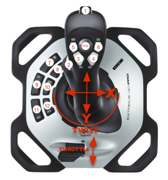

# Joystick layout



## Joystick 0: stick

* __Button 1__: intake: _whileHeld_: ```new IntakeCommand(m_intakeSubsystem, m_scottySubsystem, 0.70)```

* __Button 2__: outake: _whileHeld_: ```new IntakeCommand(m_intakeSubsystem, m_scottySubsystem, -0.60)```

## Joystick 1: climbStick

* __Button 1__: fire: _whileHeld_: ```new FireCommand(m_scottySubsystem, m_shooterSubsystem, 0.3)```

* __Button 2__: spinUp: _toggleWhenPressed_: ```new SpinCommand(m_shooterSubsystem, shooterSpeed, false)```

* __Button 3__: climb: _whileHeld_: ```new ClimbCommand(m_climberSubsystem, () -> m_climbStick.getY())```

* __Button 4__: rotate: _whenPressed_: ```new RotateCommand(m_climberSubsystem)```

* __Button 5__: spinLow: _toggleWhenPressed_: ```new SpinCommand(m_shooterSubsystem, shooterSpeed, true)```

## Joystick 5: calibStick

* __Button 2__: calibrateShooter: _toggleWhenPressed_: ```new CalibrateShooterSpeedCommand(m_shooterSubsystem, () -> m_calibStick.getThrottle())```

* __Button 3__: testTargeting: _toggleWhenPressed_: ```new AimToTargetCommand(m_shooterSubsystem, m_driveSubsystem, m_camera, 1500)```

* __Button 4__: autoClimb: _whenPressed_: ```new AutoClimbCommand(m_climberSubsystem)```

```commit 63367e4e05dda466673c9777f1d129c5b95e9f0c Author: Ryder Casazza <rydercasazza@gmail.com> Date:   Mon Mar 28 17:35:13 2022 -0700 Fixed auto lcimb ```

